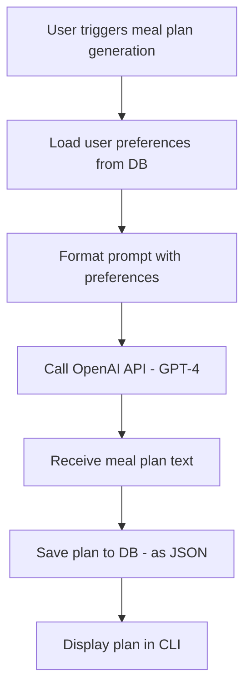

# AI Recommendation Design – MVP Focus

## 🧠 Objective
Design a lightweight AI integration strategy for generating weekly meal plans using GPT-4, tailored to user dietary preferences and cooking constraints.

---

## ✅ MVP Scope

### Step-by-step Flow:
1. Load user preferences from the local SQLite database
2. Build a text prompt that includes:
   - Dietary restrictions
   - Budget
   - Cooking time and skill level
   - Servings
3. Call OpenAI GPT-4 API with this prompt
4. Receive response (7-day meal plan)
5. Store the plan in the database as JSON
6. Display the plan in the CLI

---

## 📦 Prompt Template
```
You are a meal planning assistant. Create a 7-day dinner meal plan for:
- A vegan beginner cook
- Cooking time per meal under 30 minutes
- $80 weekly budget
- Feeds 2 people

List each meal as:
Day X: [Meal Name] - [Short description with ingredients]
```

---

## 📊 API Strategy
- Use OpenAI’s `gpt-4` or `gpt-3.5-turbo`
- Use `python-dotenv` to manage the API key
- Handle and log any errors from the API

---

## 🧠 Data Storage
- Store entire plan as a JSON blob
- Link to the user ID and plan creation timestamp

---

## 🧪 Future Scope
- Store ingredients separately and normalize into shopping lists
- Add rating and feedback loop for fine-tuning recommendations
- Train a local model on scraped recipes or use embeddings to cluster plans

---

## 🗺️ Mermaid Diagram: AI Meal Planning Flow


---

## 🔧 Libraries Used
| Tool | Purpose |
|------|---------|
| `openai` | Connect to GPT-4 API |
| `dotenv` | Manage API keys securely |
| `sqlite3` / `sqlalchemy` | Local data persistence |
| `typer` or `rich` | CLI interface (pretty formatting) |

---

## 🚫 Out of Scope for MVP
- Embedding-based recommendations
- Shopping list generation
- Nutrition analysis or calories
- Long-term plan personalization with feedback scoring

