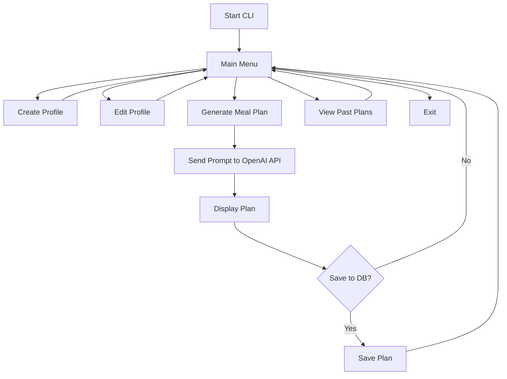

# CLI Interface Design – MVP Scope

## 🧠 Purpose
Design a clear and beginner-friendly command-line interface for managing user profiles and generating AI-assisted meal plans.

---

## ✅ MVP Features in CLI

### 🏁 Main Menu
1. Create user profile
2. View/edit user profile
3. Generate new weekly meal plan
4. View previously generated plans
5. Exit

Each option will route to a handler function within the `cli/interface.py` module.

---

## 👤 User Profile Interaction
When creating a profile, prompt for:
- Name
- Cooking skill level
- Dietary restrictions (comma-separated)
- Time per meal (minutes)
- Servings
- Weekly budget

This profile is stored in the local SQLite DB. Only 1 profile is supported in MVP.

---

## 🍽️ Meal Plan Generation
- When the user selects option 3, load their preferences
- Format a prompt and call GPT-4
- Display the 7-day meal plan in a readable format
- Ask user if they want to save the plan

---

## 📁 Plan History
- Option 4 shows a list of previously generated plans with dates
- Selecting one displays it in full

---

## 🎨 CLI Styling Goals
- Use `typer` or `rich` to make output colorful and structured
- Group sections with boxes, lines, or padding
- Always show clear success/failure messages

---

## 🗺️ Mermaid CLI Menu Flow Diagram

---

## 🔮 Future CLI Features (Post-MVP)
- Support multiple user profiles
- Export plan to PDF or Markdown
- Create printable shopping lists
- Recipe bookmarking and rating

---

## 🧼 Command Summary Table
| Command / Option | Description |
|------------------|-------------|
| `1` | Create user profile |
| `2` | View/edit profile |
| `3` | Generate new meal plan |
| `4` | View plan history |
| `5` | Exit the app |

