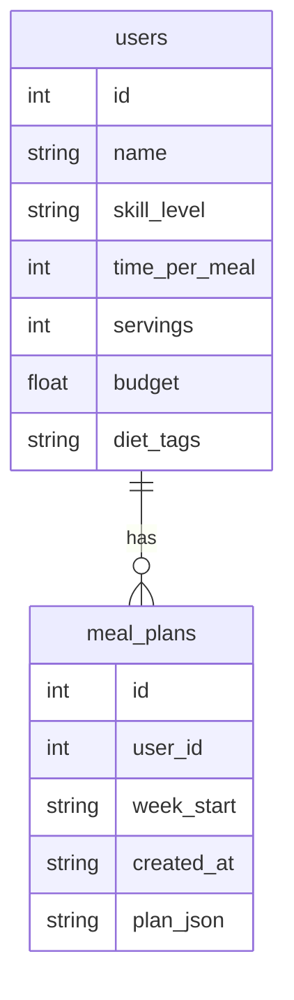

# Database Schema – MVP Scope

## 🧠 Purpose
Design a simple, normalized SQLite schema to support user profiles and meal plan generation history for a CLI-based AI meal planner.

---

## ✅ Tables for MVP

### `users`
Stores one user profile (MVP supports only one).
| Field          | Type    | Description                     |
|----------------|---------|---------------------------------|
| id             | INTEGER | Primary key                     |
| name           | TEXT    | User's name                     |
| skill_level    | TEXT    | Beginner, Intermediate, etc.    |
| time_per_meal  | INTEGER | Max cooking time in minutes     |
| servings       | INTEGER | People per meal                 |
| budget         | REAL    | Weekly food budget              |
| diet_tags      | TEXT    | Comma-separated preferences      |

### `meal_plans`
Stores full 7-day meal plans as JSON blobs.
| Field         | Type    | Description                         |
|---------------|---------|-------------------------------------|
| id            | INTEGER | Primary key                         |
| user_id       | INTEGER | FK → users.id                       |
| week_start    | TEXT    | ISO date string (YYYY-MM-DD)        |
| created_at    | TEXT    | Timestamp when plan was created     |
| plan_json     | TEXT    | Raw GPT response / structured JSON  |

---

## 📦 Optional Future Tables
- `recipes` – to normalize meals across plans
- `ingredients` – for shopping list support
- `feedback` – to store user reviews and fine-tune logic

---

## 🗺️ Entity-Relationship Diagram (Mermaid)

---

## 🧰 Implementation Notes
- Use SQLAlchemy ORM (or raw SQL)
- Migrations not required for MVP
- Consider `sqlite3` for first pass

---

## 🚫 Out of Scope
- Shopping list generation
- Multi-user support
- Recipe detail normalization

